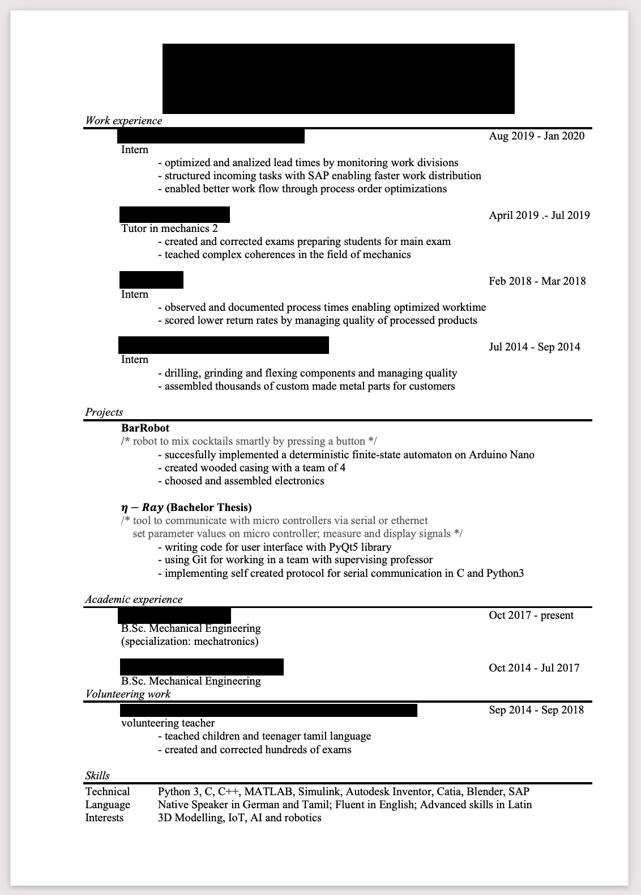

While being mod in the [CS Career Hub](https://cscareerhub.com/) discord I have looked at and suggested improvements for many resumes over the time. I used the knowledge I gained there to land internships at companies like jetbrains or amazon.
As of recentely quite a few of my friends and acquaintances have decided to do a career move into tech or are about to finish their degree in a tech related study and many of them are asking me about advice on how to improve their resume. Since I am becoming too lazy to reitarate the same points over and over, this blog post is supposed to be a first reference before asking me for advice.
A good friend of mine, lets call him Noah, whom I advised about his resume was so nice and give me permission to use his resume as an example, you will see the first version and its improvements below.
# The form
First things first, what resume template should you use? Honestly it doesnt matter much, I recommend some template from [overleaf](https://de.overleaf.com/gallery/tagged/cv) and I personally use [this](https://de.overleaf.com/latex/templates/jakes-resume-anonymous/cstpnrbkhndn) one. But feel free to use any resume template you seem fit. Also consider that some european companies, for instance in germany, do prefer a picture in the resume. The template should fullfill some basic things, as you will see below.
Lets look at the first resume Noah send me in order to see what basic form a resume should have.
I removed all the personal information, they were applying for internships in the field of embedded software engineering.
.
Just looking at this resume, I immediately advised Noah to change their resume template.
There are way too many headlines that dont provide any content, the headlines "position", "time period"  and "field of work" all appear a total of four times in the whole resume. Additionally the actual content is too short, Noah had multible job experiences but the resume barely explains what they entailed.
Here a quick summary when looking at the form of your own resume:
- Avoid using any headlines like "time period", they waste space
- Keep your paragraphs short, but not too short. A recruiter should be able to skimp over your resume quickly, but it should still hold all the necessary information 

## The content
So after looking at those superficial but still very important aspects of a resume, lets get to the meat, the actual content. So what is my friend doing wrong here? Aside of the resume barely having any content at all, the way they talk about their past experience is wrong. They just state their job description as if it was some to-do list. What they actually should be doing is to focus on their impact first. How did they make the company money? A job posting is about business after all, you work for a company to make them more money than they pay for you. Your resume should reflect that. How did you make your company money, and what impact did you have in this process? 
A common mistake I see in resume (admittedly not in this one) is that people talk about all their technical skills and how they implemented XY in framework Z. What they dont realize is that the tech is not that important, the actual impact the tech had is much much more important.
Why did you implement XY? Did it make some process more efficient, did it solve some business critical problem? Focus on that! Of course having some metrics would make it even more impressive, though it is not always realistic to have those at hand (How much money did ur process save?, how many people use your software regularly?, etc.)
And only after you have explained all the impact you had in your company and how you improved your company from the inside, only then you should talk about what specific technologies you used to achieve that.  
This is of course talking about actual job experience. In side projects most of the time you will only be able to show your technical skills, which is fine too, but also the reason why side projects are worth much less than actual job experience.
So as a summary on what one should pay attention when writing their resume:
- Focus on the impact when talking about your past job experience only mention the technology after that
- Try to add metrics when possible

# The final version
So after considering all this feedback, this is Noahs resume in its final form.

Much better don't you think? 
If you happen to be one of my friends that is planning to ask me for resume advice, please follow the guide lines on this blog post first. If you don't do that, dont be suprised if you get a link to this post as an answer to your request for advice.